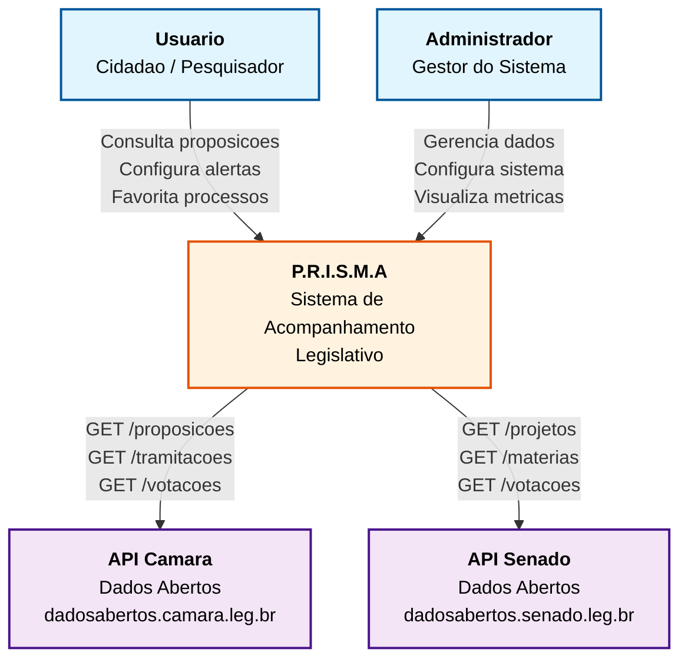
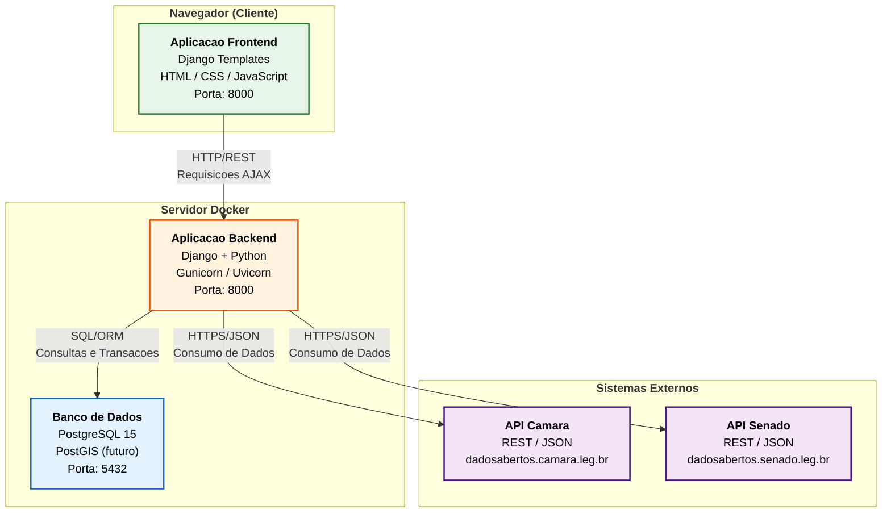
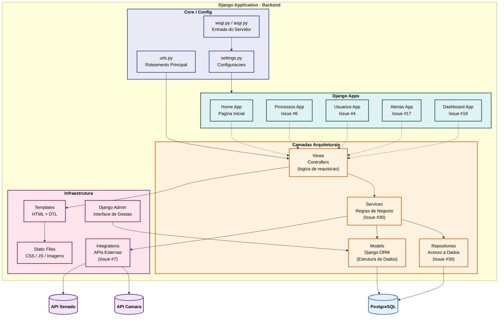
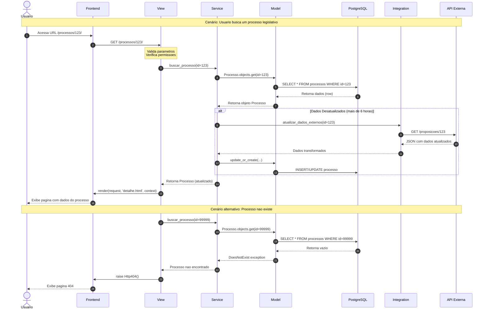

# Diagramas C4 — P.R.I.S.M.A

Este documento apresenta a arquitetura do sistema P.R.I.S.M.A utilizando o modelo **C4** (Contexto, Containers, Componentes e Codigo), com diagramas gerados em **Mermaid** para visualizacao direta no GitHub.

---

## Diagrama de Contexto

**Proposito:** Mostrar o sistema como um todo, seus usuarios e as interacoes com sistemas externos.

---

## Diagrama de Containers

**Proposito:** Mostrar as aplicacoes (containers) que compoem o sistema e como se comunicam.

---

## Diagrama de Componentes (Backend)

**Proposito:** Mostrar os componentes internos do backend Django e suas relacoes.

---

## Fluxo de Dados Completo

**Proposito:** Mostrar a sequencia de interacoes em uma requisicao tipica.

---

## Referencias

- [Modelo C4 - Documentacao Oficial](https://c4model.com/)
- [Mermaid.js - Documentacao](https://mermaid.js.org/)
- [Django Architecture - Documentacao Oficial](https://docs.djangoproject.com/)
- [Issue #31 - Documentacao de Arquitetura](https://github.com/unb-mds/2026-1-P.R.I.S.M.A/issues/31)

---
